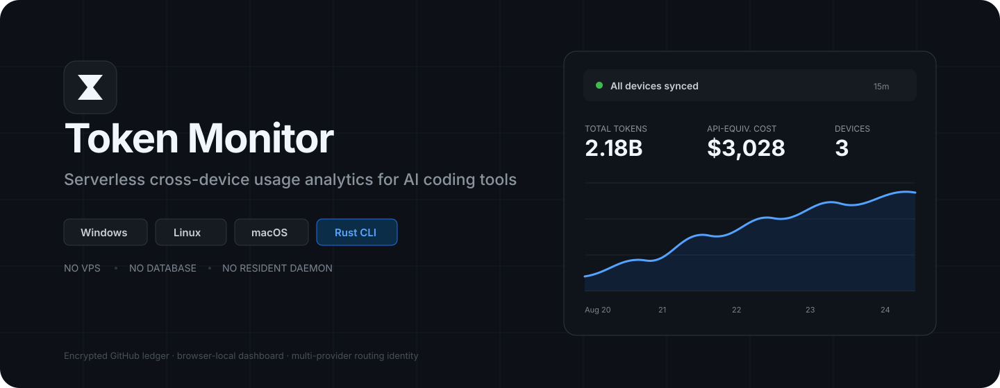

<p align="center">
  
</p>

<p align="center">
  
  
  
  <a href="LICENSE"></a>
</p>

<p align="center"><strong>把多台设备、多个 AI Coding 客户端的 Token、路由和订阅等价费用聚合到一个轻量 Dashboard。</strong></p>

<p align="center">
  <a href="README.md">English</a> ·
  <a href="https://token-monitor-cuidongshan350-1312.vercel.app/">Dashboard</a> ·
  <a href="SOURCES.md">数据与价格来源</a> ·
  <a href="SECURITY.md">安全</a>
</p>

## 为什么做 Token Monitor

AI Coding 的用量往往分散在多台电脑、多个 CLI 和不同 Provider 中。Token Monitor 把这些本地统计统一起来，同时保持三条原则：

- **不上传 Prompt、回复、代码或项目内容**；
- **不常驻后台**，每次同步执行完立即退出；
- **核心解析和计费优先复用成熟项目**，不重复发明 Token 语义和价格规则。

它没有服务器、数据库、Electron、Node daemon 或额外的数据仓库。你的 fork 本身就是加密账本存储。

## v1.1 一览

| 能力 | 实现 |
| --- | --- |
| 多客户端 | Tokscale Core v4.14.0 负责 discovery / parser / dedup / token semantics / model normalization |
| 多设备 | Windows、Linux、macOS；x64 + ARM64 |
| Dashboard | 一个固定网址；任意浏览器输入同一个短密码即可 |
| 加密 | AES-256-GCM；密码经 PBKDF2-HMAC-SHA256 只用于包裹随机 workspace key |
| 低负载 | launchd / Task Scheduler / systemd-user / cron，每约 15 分钟运行一次 one-shot sync |
| 路由 | upstream vendor、route provider、route type、raw provider 分开记录 |
| 官方路由 | 证据确认第一方后统一显示 **“官方”**，但 raw provider 仍保留审计 |
| 价格 | 通用模型跟随 CC Switch 同源的 models.dev；GPT-5.6 使用 CC Switch / Sub2API 交叉核对费率 |
| 图表 | New API 风格；可折叠侧栏；精确 tooltip；K/M/B/T 自适应坐标轴；CSV 导出 |
| Linux | v1.1 使用静态 musl，避免旧系统 `GLIBC_2.xx not found` |
| Windows | PowerShell 5.1 / 7，x64 / ARM64；不依赖新版 RuntimeInformation API |

## 安装

### macOS / Linux

```bash
curl -fsSL https://raw.githubusercontent.com/Atingaii/token-monitor/main/install.sh | sh
```

Linux v1.1 使用静态 musl 二进制，不要求与你的发行版具有 GitHub runner 那样新的 glibc。

如果安装器提示当前 shell 尚未获得 PATH，它会直接打印可立即运行的绝对路径，例如：

```bash
'/home/you/.local/bin/token-monitor' setup
```

### Windows PowerShell

```powershell
irm https://raw.githubusercontent.com/Atingaii/token-monitor/main/install.ps1 | iex
```

> Windows PowerShell 中的 `curl` 通常是 `Invoke-WebRequest` 的别名。不要使用 Unix 的 `curl -fsSL ... | sh` 命令。

安装器会自动识别 x64 / ARM64、启用 TLS 1.2 兼容、校验 SHA-256，并处理用户 PATH。

## 第一台设备

```bash
token-monitor setup
```

程序会自动：

1. 从 `--token`、环境变量、`gh auth token` 或隐藏输入中解析 GitHub 凭据；
2. 查找你的 `Atingaii/token-monitor` fork，必要时自动 fork；
3. 生成随机 256-bit workspace key；
4. 让你设置一个好记的 Dashboard 密码；
5. 发布密码包裹后的 `tm-dashboard/access.json`；
6. 完整扫描本地 AI Coding 用量；
7. 上传设备自己的加密 snapshot；
8. 注册原生定时同步；
9. 打印 Dashboard 和新设备 join 命令。

你的主 Dashboard 只有一个地址：

**https://token-monitor-cuidongshan350-1312.vercel.app/**

不需要记 `#key=...`，也不需要依赖某个浏览器的 localStorage。换电脑、手机、无痕窗口，都输入同一个密码即可。

## 添加其他设备

第一台设备会输出：

```bash
token-monitor join '<PAIR_CODE>'
```

直接粘贴到其他 Windows / Linux / macOS 机器。每台设备使用自己的 GitHub 写入凭据；Pair Code 不包含 GitHub Token。

重新查看 join 命令：

```bash
token-monitor invite
```

## 从 v1.0 升级

先重新运行上面的安装命令，然后在已有设备执行：

```bash
token-monitor password
token-monitor sync --full
```

v1.1 的 ledger schema 已升级。旧缓存不会继续沿用旧价格；第一次 v1.1 同步会重建历史统计，之后恢复增量扫描。

## 价格口径

页面显示的是 **Subscription-equivalent cost / 订阅等价费用**，不是供应商实际发票，也不是 ChatGPT/Codex 套餐后台真实扣款。

### GPT-5.6

单位：USD / 1M Tokens。

| 模型 | Input | Cache Read | Cache Write | Output |
| --- | ---: | ---: | ---: | ---: |
| GPT-5.6 Sol | **$5.00** | **$0.50** | **$6.25** | **$30.00** |
| GPT-5.6 Terra | $2.00 | $0.20 | $2.50 | $12.00 |
| GPT-5.6 Luna | $0.20 | $0.02 | $0.25 | $1.20 |

Fast / Priority 使用明确的 **2×** tier 费率。`>272K` 长上下文判断发生在**单次请求**，不是日聚合之后。

例如：

```text
182,000 fresh input × $5/M
6,080,000 cache read × $0.50/M
12,000 output × $30/M
≈ $4.31
```

这解释了为什么旧 `$4/$20/$0.40` API 口径约为 `$3.40`，而 v1.1 订阅等价口径约为 `$4.31`。

### 其他模型

通用价格目录使用与 CC Switch 相同的 `models.dev` 数据源。未知或不完整价格不会用相邻模型猜测；无法完整计价时会保留 lower-bound 标记。

详细来源与许可证：[`SOURCES.md`](SOURCES.md)。

## 路由语义

Token Monitor 不会因为看到 GPT / Claude 模型就假定它来自官方线路。

| 字段 | 含义 | 示例 |
| --- | --- | --- |
| `model` | 标准化模型 | `gpt-5.6-sol` |
| `upstreamVendor` | 模型厂商 | `openai` |
| `routeProvider` | 实际路由 | `official`, `azure-openai`, `openrouter`, `newapi` |
| `routeType` | 路由类别 | `official`, `cloud`, `aggregator`, `relay`, `unknown` |
| `provider` | 原始来源 | 保留审计 |

只有明确证据证明是第一方线路时，中文 UI 才显示 **“官方”**。非官方线路继续显示实际供应商名称。

## Dashboard

v1.1 使用克制、现代的管理后台视觉语言，参考新版 New API 的信息密度与布局方向，但前端代码独立实现。

支持：

- 可折叠桌面侧栏、移动端 drawer；
- Light / Dark；
- 今日 / 7 天 / 30 天 / 本月 / 全部 / 自定义时间；
- 设备、工具、模型、厂商、路由、Provider、Tier 联动筛选；
- 折线、面积、柱状、堆叠柱、环形、Treemap、表格；
- 精确 tooltip 与千位分隔完整数值；
- Y 轴 nice-scale、自适应边距和 K/M/B/T 可读刻度；
- CSV 导出。

## 数据与隐私

远端账本只包含聚合统计和必要的来源标签，例如日期、设备、客户端、模型、Token buckets、路由、Tier、费用。

不会上传：

- Prompt / 回复 / reasoning 文本；
- 源代码和项目文件内容；
- 完整会话原文；
- 项目路径；
- `auth.json`；
- API Key；
- GitHub Token。

每台设备拥有自己的 `tm-ledger-*` snapshot branch；主分支只放源码。

## 常用命令

```bash
token-monitor setup
token-monitor sync
token-monitor sync --full
token-monitor status
token-monitor clients
token-monitor dashboard
token-monitor invite
token-monitor password
token-monitor uninstall
```

## 低负载设计

Token Monitor 不运行常驻 daemon。

```text
系统调度器
   ↓ 每约 15 分钟
启动 token-monitor sync --quiet
   ↓
增量扫描本地记录
   ↓
有变化 → 更新自己的加密 snapshot
无变化 → 不写 GitHub
   ↓
进程退出
```

因此两次同步之间常驻内存为 0。

## 开发与来源

核心解析来自 [`junhoyeo/tokscale`](https://github.com/junhoyeo/tokscale) v4.14.0；Codex tier 证据策略参考 [`falyx6851-byte/codex-monitor`](https://github.com/falyx6851-byte/codex-monitor)。Token Monitor 自己负责跨设备加密账本、路由证据、Dashboard 和同步协议。

更完整的 provenance 见 [`SOURCES.md`](SOURCES.md)，第三方版权见 [`NOTICE`](NOTICE)。

## License

MIT © Token Monitor contributors
